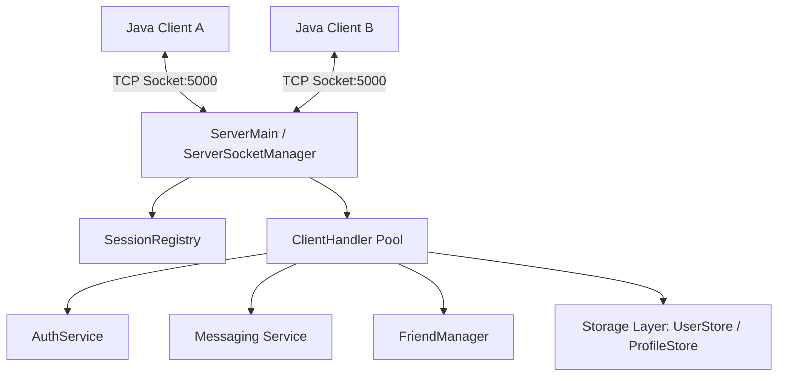

# Java Socket Messenger

[](https://www.java.com/)
[](#architecture)
[](#concurrency--networking)
[](LICENSE)

A modular, multi-threaded Java messaging and chat platform built from the ground up using raw TCP sockets (`java.net.Socket`), multithreading, and an object-oriented domain architecture.

---

## 🌟 Key Features

* **TCP Socket Networking**: Pure socket-based communication between clients and a central server without external messaging libraries.
* **Concurrent Client Handling**: Uses multi-threaded `ClientHandler` threads to manage multiple concurrent client sessions independently.
* **User Authentication**: Built-in authentication service with credential validation and session registration.
* **Presence & Profile Management**: Real-time status tracking (`ONLINE`, `AWAY`, `OFFLINE`) and user profile management.
* **Messaging & File Transfer**: Extensible message hierarchy supporting both direct text messages (`TextMessage`) and binary file transfers (`FileMessage`).
* **Friendship Network**: Maintain friend lists and friendship request management (`FriendManager`).
* **Data Persistence**: Dedicated storage layer (`UserStore`, `ProfileStore`, `FileStorage`) for persistent chat and account state.

---

## 🏗️ Architecture



---

## 📁 Project Structure

```text
java-socket-messenger/
├── auth/                 # Authentication services & credential validation
│   ├── AuthService.java
│   ├── AuthValidator.java
│   └── UserCredentials.java
├── client/               # Client-side connection & I/O dispatchers
│   ├── ClientMain.java
│   ├── ClientSocket.java
│   ├── InputReader.java
│   └── OutputWriter.java
├── friends/              # Friendship relations and request handling
│   ├── FriendList.java
│   └── FriendManager.java
├── messaging/            # Polymorphic message contracts and handlers
│   ├── FileMessage.java
│   ├── Message.java
│   ├── MessageType.java
│   └── TextMessage.java
├── profile/              # User metadata and presence tracking
│   ├── PresenceStatus.java
│   ├── ProfileService.java
│   └── UserProfile.java
├── server/               # Multi-threaded server daemon & socket loops
│   ├── ClientHandler.java
│   ├── ServerConfig.java
│   ├── ServerMain.java
│   ├── ServerSocketManager.java
│   └── SessionRegistry.java
├── storage/              # File and record persistence engines
│   ├── FileStorage.java
│   ├── ProfileStore.java
│   └── UserStore.java
├── Main.java             # Unified application launcher
└── setup.sh              # Project scaffold script
```

---

## 🚀 Getting Started

### Prerequisites
* Java Development Kit (JDK 17 or later recommended)
* `javac` and `java` available on your `PATH`

### 1. Compile the Source
Compile all modules from the project root:

```bash
javac auth/*.java client/*.java friends/*.java messaging/*.java profile/*.java server/*.java storage/*.java Main.java
```

### 2. Start the Server
Launch the central socket server (listens on default port `5000`):

```bash
java server.ServerMain
```
*Console output:*
```text
Server starting on port 5000
```

### 3. Connect a Client
In a separate terminal, launch a client instance:

```bash
java client.ClientMain
```

You can start multiple terminal windows to run concurrent client instances and test multi-user chat sessions.

---

## 🛠️ Tech Stack & Design Patterns

* **Language**: Java
* **Networking**: `java.net.ServerSocket`, `java.net.Socket`
* **Concurrency**: Java Threads, Worker Thread per Client Model
* **Patterns Used**:
  * **Facade Pattern**: `AuthService`, `ProfileService`
  * **Polymorphism**: Base `Message` with `TextMessage` & `FileMessage`
  * **Registry Pattern**: `SessionRegistry` for tracking active user channels

---

## 📄 License

This project is licensed under the MIT License - see the LICENSE file for details.
